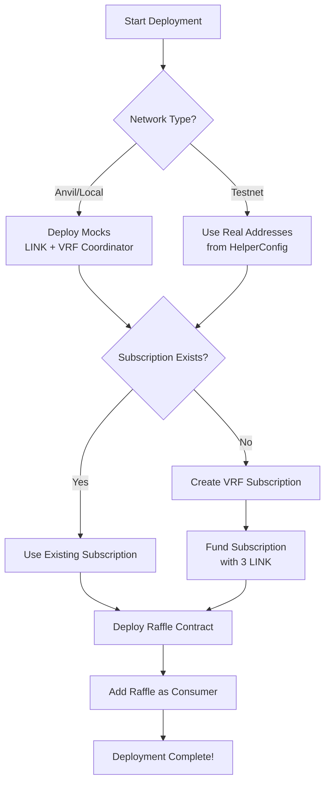

# Deployment Guide - Decentralized Raffle Game

Complete guide for deploying and interacting with the Raffle contract on any network.

---

## Table of Contents
- [Quick Start](#quick-start)
- [Prerequisites](#prerequisites)
- [Deployment Flow](#deployment-flow)
- [Network-Specific Deployment](#network-specific-deployment)
- [Manual Deployment Steps](#manual-deployment-steps)
- [Testing Locally](#testing-locally)
- [Troubleshooting](#troubleshooting)

---

## Quick Start

### Deploy on Local Anvil
```bash
# Terminal 1: Start Anvil
anvil

# Terminal 2: Deploy
forge script script/DeployRaffle.s.sol --rpc-url http://127.0.0.1:8545 --broadcast
```

### Deploy on Sepolia Testnet
```bash
forge script script/DeployRaffle.s.sol \
  --rpc-url $SEPOLIA_RPC_URL \
  --broadcast \
  --verify \
  --etherscan-api-key $ETHERSCAN_API_KEY
```

---

## Prerequisites

### For All Deployments
- Foundry installed (`curl -L https://foundry.paradigm.xyz | bash`)
- Git submodules initialized (`git submodule update --init --recursive`)
- Environment variables set (create `.env` file):
  ```bash
  # RPC URLs
  SEPOLIA_RPC_URL=your_sepolia_rpc_url
  BASE_SEPOLIA_RPC_URL=your_base_sepolia_rpc_url
  BNB_TESTNET_RPC_URL=your_bnb_testnet_rpc_url
  POLYGON_AMOY_RPC_URL=your_polygon_amoy_rpc_url

  # Private key (for testnet deployments)
  PRIVATE_KEY=your_private_key_here

  # API keys (for verification)
  ETHERSCAN_API_KEY=your_etherscan_api_key
  BASESCAN_API_KEY=your_basescan_api_key
  BSCSCAN_API_KEY=your_bscscan_api_key
  POLYGONSCAN_API_KEY=your_polygonscan_api_key
  ```

### For Testnet Deployments
1. **Get Testnet ETH** (native gas token):
   - Sepolia: https://sepoliafaucet.com/
   - Base Sepolia: https://docs.base.org/tools/network-faucets
   - BNB Testnet: https://testnet.bnbchain.org/faucet-smart
   - Polygon Amoy: https://faucet.polygon.technology/

2. **Get Testnet LINK** (for funding subscription):
   - All networks: https://faucets.chain.link/

3. **Create VRF Subscription** (if deploying manually):
   - Visit https://vrf.chain.link/
   - Select your network
   - Create subscription
   - Note the subscription ID
   - Update `HelperConfig.s.sol` with your subscription ID

---

## Deployment Flow

The `DeployRaffle.s.sol` script handles the complete deployment automatically:



### What Happens Automatically

1. **Network Detection**: HelperConfig detects chain ID and loads appropriate config
2. **Mock Deployment** (Anvil only): Deploys LinkToken and VRFCoordinatorV2_5Mock
3. **Subscription Creation**: Creates new subscription if none exists
4. **Subscription Funding**: Funds subscription with 3 LINK
5. **Raffle Deployment**: Deploys Raffle with network-specific parameters
6. **Consumer Registration**: Adds Raffle as authorized consumer

---

## Network-Specific Deployment

### Ethereum Sepolia
```bash
source .env
forge script script/DeployRaffle.s.sol \
  --rpc-url $SEPOLIA_RPC_URL \
  --private-key $PRIVATE_KEY \
  --broadcast \
  --verify \
  --etherscan-api-key $ETHERSCAN_API_KEY \
  -vvvv
```

**Network Details:**
- Chain ID: 11155111
- VRF Coordinator: `0x9DdfaCa8183c41ad55329BdeeD9F6A8d53168B1B`
- LINK Token: `0x779877A7B0D9E8603169DdbD7836e478b4624789`
- Gas Key Hash: `0x787d74caea10b2b357790d5b5247c2f63d1d91572a9846f780606e4d953677ae` (150 gwei)

### Base Sepolia
```bash
forge script script/DeployRaffle.s.sol \
  --rpc-url $BASE_SEPOLIA_RPC_URL \
  --private-key $PRIVATE_KEY \
  --broadcast \
  --verify \
  --etherscan-api-key $BASESCAN_API_KEY \
  -vvvv
```

**Network Details:**
- Chain ID: 84532
- **⚠️ Verify VRF addresses at**: https://docs.chain.link/vrf/v2-5/supported-networks#base-sepolia

### BNB Chain Testnet
```bash
forge script script/DeployRaffle.s.sol \
  --rpc-url $BNB_TESTNET_RPC_URL \
  --private-key $PRIVATE_KEY \
  --broadcast \
  --verify \
  --etherscan-api-key $BSCSCAN_API_KEY \
  -vvvv
```

**Network Details:**
- Chain ID: 97
- **⚠️ Verify VRF addresses at**: https://docs.chain.link/vrf/v2-5/supported-networks#bnb-chain-testnet

### Polygon Amoy
```bash
forge script script/DeployRaffle.s.sol \
  --rpc-url $POLYGON_AMOY_RPC_URL \
  --private-key $PRIVATE_KEY \
  --broadcast \
  --verify \
  --etherscan-api-key $POLYGONSCAN_API_KEY \
  -vvvv
```

**Network Details:**
- Chain ID: 80002
- **⚠️ Verify VRF addresses at**: https://docs.chain.link/vrf/v2-5/supported-networks#polygon-amoy

---

## Manual Deployment Steps

If you prefer to deploy step-by-step:

### Step 1: Create Subscription
```bash
forge script script/interactions/CreateSubscription.s.sol \
  --rpc-url $RPC_URL \
  --private-key $PRIVATE_KEY \
  --broadcast
```

Note the subscription ID from the output.

### Step 2: Fund Subscription
```bash
# Make sure you have LINK tokens in your wallet first!
forge script script/interactions/FundSubscription.s.sol \
  --sig "fundSubscription(address,uint256,address,address)" \
  <VRF_COORDINATOR> <SUBSCRIPTION_ID> <LINK_TOKEN> <YOUR_ADDRESS> \
  --rpc-url $RPC_URL \
  --private-key $PRIVATE_KEY \
  --broadcast
```

### Step 3: Deploy Raffle
Update `HelperConfig.s.sol` with your subscription ID, then:
```bash
forge create src/Raffle.sol:Raffle \
  --constructor-args <ENTRANCE_FEE> <INTERVAL> <OWNER> <VRF_COORDINATOR> <GAS_KEY_HASH> <SUBSCRIPTION_ID> <CALLBACK_GAS_LIMIT> \
  --rpc-url $RPC_URL \
  --private-key $PRIVATE_KEY \
  --verify \
  --etherscan-api-key $ETHERSCAN_API_KEY
```

### Step 4: Add Consumer
```bash
forge script script/interactions/AddConsumer.s.sol \
  --sig "addConsumer(address,address,uint256,address)" \
  <RAFFLE_ADDRESS> <VRF_COORDINATOR> <SUBSCRIPTION_ID> <YOUR_ADDRESS> \
  --rpc-url $RPC_URL \
  --private-key $PRIVATE_KEY \
  --broadcast
```

---

## Testing Locally

### Complete Local Test Flow

```bash
# Terminal 1: Start Anvil
anvil

# Terminal 2: Deploy
export RAFFLE_ADDRESS=$(forge script script/DeployRaffle.s.sol \
  --rpc-url http://127.0.0.1:8545 \
  --broadcast \
  --json | jq -r '.returns.raffle.value')

echo "Raffle deployed at: $RAFFLE_ADDRESS"

# Enter raffle with 3 different accounts
cast send $RAFFLE_ADDRESS "enterRaffleGame()" \
  --value 0.01ether \
  --rpc-url http://127.0.0.1:8545 \
  --private-key 0xac0974bec39a17e36ba4a6b4d238ff944bacb478cbed5efcae784d7bf4f2ff80

cast send $RAFFLE_ADDRESS "enterRaffleGame()" \
  --value 0.01ether \
  --rpc-url http://127.0.0.1:8545 \
  --private-key 0x59c6995e998f97a5a0044966f0945389dc9e86dae88c7a8412f4603b6b78690d

cast send $RAFFLE_ADDRESS "enterRaffleGame()" \
  --value 0.01ether \
  --rpc-url http://127.0.0.1:8545 \
  --private-key 0x5de4111afa1a4b94908f83103eb1f1706367c2e68ca870fc3fb9a804cdab365a

# Fast forward time (past interval - default 30 seconds)
cast rpc evm_increaseTime 31 --rpc-url http://127.0.0.1:8545
cast rpc evm_mine --rpc-url http://127.0.0.1:8545

# Trigger upkeep and pick winner
forge script script/interactions/PerformUpkeep.s.sol \
  --sig "performUpkeep(address)" $RAFFLE_ADDRESS \
  --rpc-url http://127.0.0.1:8545 \
  --broadcast

# Check winner
cast call $RAFFLE_ADDRESS "getRecentWinner()" --rpc-url http://127.0.0.1:8545
```

### Query Raffle State
```bash
# Get entrance fee
cast call $RAFFLE_ADDRESS "getEntranceFee()" --rpc-url $RPC_URL

# Get player count
cast call $RAFFLE_ADDRESS "getPlayersCount()" --rpc-url $RPC_URL

# Get raffle state (0=OPEN, 1=CALCULATING, 2=CLOSED)
cast call $RAFFLE_ADDRESS "getRaffleState()" --rpc-url $RPC_URL

# Get prize pool
cast call $RAFFLE_ADDRESS "getPrizePool()" --rpc-url $RPC_URL

# Get recent winner
cast call $RAFFLE_ADDRESS "getRecentWinner()" --rpc-url $RPC_URL

# Check if upkeep needed
cast call $RAFFLE_ADDRESS "checkUpkeep(bytes)" 0x --rpc-url $RPC_URL
```

---

## Troubleshooting

### Issue: "Subscription not found"
**Solution:** Create a new subscription or verify subscription ID in HelperConfig

### Issue: "Invalid consumer"
**Solution:** Make sure Raffle address is added as consumer to the subscription

### Issue: "Insufficient LINK balance"
**Solution:** Fund subscription with more LINK tokens using FundSubscription script

### Issue: "Upkeep not needed"
**Solution:** Check that:
- Raffle is in OPEN state
- At least 3 players have entered
- Enough time has passed (>= interval)
- Contract has balance (>0)

### Issue: "Compiler errors about Chainlink imports"
**Solution:**
```bash
# Initialize git submodules
git submodule update --init --recursive

# Or manually install
forge install smartcontractkit/chainlink-brownie-contracts@1.3.0 --no-commit
```

### Issue: "Transaction reverted" on VRF request
**Solution:**
- Check subscription is funded with LINK
- Verify callback gas limit is sufficient (default: 500,000)
- Ensure Raffle is added as consumer

---

## Advanced Configuration

### Update Network Config
Edit `script/HelperConfig.s.sol` to customize:
- Entrance fee (default: 0.01 ETH)
- Interval between raffles (default: 30 seconds)
- Callback gas limit (default: 500,000)
- Subscription ID (if pre-existing)

### Update VRF Parameters
Check latest addresses at:
- **VRF v2.5 Docs**: https://docs.chain.link/vrf/v2-5/supported-networks
- **LINK Tokens**: https://docs.chain.link/resources/link-token-contracts

### Deploy to New Network
1. Add network config to `HelperConfig.s.sol`
2. Add chain ID constant
3. Implement `get<Network>Config()` function
4. Update constructor to handle new chain ID

---

## Deployment Checklist

### Pre-Deployment
- [ ] Git submodules initialized
- [ ] Environment variables set (.env file)
- [ ] Testnet ETH in wallet (for gas)
- [ ] Testnet LINK in wallet (for subscription funding)
- [ ] VRF addresses verified for target network

### Deployment
- [ ] Deploy script executed successfully
- [ ] Raffle contract address noted
- [ ] Subscription ID noted
- [ ] Raffle added as consumer
- [ ] Subscription funded with LINK

### Post-Deployment
- [ ] Contract verified on block explorer
- [ ] Entrance fee is correct
- [ ] Interval is appropriate
- [ ] VRF coordinator set correctly
- [ ] Test entering raffle
- [ ] Monitor for first winner selection

### Automation Setup (Optional)
- [ ] Register with Chainlink Automation
- [ ] Fund Automation upkeep
- [ ] Test automatic winner selection

---

## Resources

- **Chainlink VRF Documentation**: https://docs.chain.link/vrf/v2-5/getting-started
- **Chainlink Automation**: https://docs.chain.link/chainlink-automation/introduction
- **Foundry Book**: https://book.getfoundry.sh/
- **Network Faucets**: https://faucets.chain.link/

---

**Questions or issues?** Open an issue on GitHub: https://github.com/vyqno/Decentralized-Raffle-Game/issues
