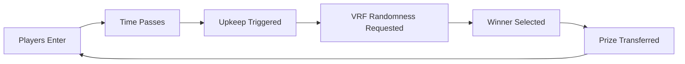

# Decentralized Raffle Game 🎰

A provably fair, decentralized raffle system powered by Chainlink VRF v2.5 for verifiable randomness.

[](https://github.com/vyqno/Decentralized-Raffle-Game/actions/workflows/test.yml)
[](https://opensource.org/licenses/MIT)

## 🌟 Features

- **Decentralized**: Fully on-chain raffle with no central authority
- **Provably Fair**: Uses Chainlink VRF v2.5 for verifiable random winner selection
- **Automated**: Chainlink Automation ready for autonomous operation
- **Secure**: Comprehensive access controls and reentrancy protection
- **Multi-Network**: Supports Sepolia, Base, BNB Chain, Polygon Amoy testnets
- **Well-Tested**: >80% code coverage with comprehensive unit and integration tests

## 📋 Overview

Players enter the raffle by paying an entrance fee. When enough time has passed and minimum players (3) have entered, the raffle automatically selects a winner using Chainlink VRF for cryptographically secure randomness. The winner receives the entire prize pool.

### How It Works



## 🚀 Quick Start

### Prerequisites

- [Foundry](https://book.getfoundry.sh/getting-started/installation)
- Git

### Installation

```bash
# Clone the repository
git clone https://github.com/vyqno/Decentralized-Raffle-Game.git
cd Decentralized-Raffle-Game

# Install dependencies
make install

# Build the project
make build
```

### Run Tests

```bash
# Run all tests
make test

# Run with coverage
make coverage

# Run specific test suite
make test-unit           # Unit tests only
make test-integration    # Integration tests only
```

### Deploy

#### Local Deployment (Anvil)

```bash
# Terminal 1: Start Anvil
anvil

# Terminal 2: Deploy
make deploy-local
```

#### Testnet Deployment

See [DEPLOYMENT.md](./DEPLOYMENT.md) for detailed deployment instructions.

## 📁 Project Structure

```
Decentralized-Raffle-Game/
├── src/
│   └── Raffle.sol              # Main raffle contract
├── script/
│   ├── DeployRaffle.s.sol      # Main deployment script
│   ├── HelperConfig.s.sol      # Network configurations
│   └── interactions/           # Interaction scripts
├── test/
│   ├── unit/                   # Unit tests
│   ├── integration/            # Integration tests
│   └── mocks/                  # Mock contracts for testing
├── DEPLOYMENT.md               # Deployment guide
└── Makefile                    # Build automation
```

## 🔧 Configuration

### Network Support

| Network | Chain ID | Status |
|---------|----------|--------|
| Ethereum Sepolia | 11155111 | ✅ Supported |
| Base Sepolia | 84532 | ✅ Supported |
| BNB Chain Testnet | 97 | ✅ Supported |
| Polygon Amoy | 80002 | ✅ Supported |
| Anvil (Local) | 31337 | ✅ Supported |

### Raffle Parameters

Default configuration (modifiable in `HelperConfig.s.sol`):

- **Entrance Fee**: 0.01 ETH
- **Interval**: 30 seconds
- **Minimum Players**: 3
- **Callback Gas Limit**: 500,000

## 🧪 Testing

This project has comprehensive test coverage including:

### Unit Tests (`test/unit/RaffleTest.t.sol`)
- Constructor initialization
- Entry mechanics (fees, state checks, re-entry prevention)
- Upkeep conditions (checkUpkeep logic)
- Winner selection (VRF fulfillment)
- Access control (owner functions)
- State transitions
- Edge cases and fuzz testing

### Integration Tests (`test/integration/DeploymentTest.t.sol`)
- Complete deployment flow
- Subscription creation and funding
- Consumer registration
- End-to-end raffle execution
- Multiple raffle rounds
- Mock contract verification

### Coverage Report

```bash
make coverage-summary
```

Target: **>80% coverage** ✅

## 📚 Documentation

- [Deployment Guide](./DEPLOYMENT.md) - Complete deployment instructions
- [Chainlink VRF Documentation](https://docs.chain.link/vrf/v2-5/getting-started)
- [Foundry Book](https://book.getfoundry.sh/)

## 🔐 Security

### Audits
- ❌ Not audited (testnet project)

### Security Considerations
- ✅ Custom errors for gas efficiency
- ✅ Checks-Effects-Interactions pattern
- ✅ State updates before external calls
- ✅ Access control on sensitive functions
- ✅ No direct ETH transfers (enforced via receive)
- ✅ Comprehensive test coverage

### Known Issues
- None currently

## 🛠️ Development

### Commands

```bash
# Format code
make format

# Check formatting
make format-check

# Run specific test contract
make test-contract RaffleTest

# Generate gas snapshot
make snapshot

# Clean build artifacts
make clean
```

## 🤝 Contributing

Contributions are welcome! Please feel free to submit a Pull Request.

1. Fork the repository
2. Create your feature branch (`git checkout -b feature/AmazingFeature`)
3. Commit your changes (`git commit -m 'Add some AmazingFeature'`)
4. Push to the branch (`git push origin feature/AmazingFeature`)
5. Open a Pull Request

## 📄 License

This project is licensed under the MIT License - see the [LICENSE](LICENSE) file for details.

## 🙏 Acknowledgments

- [Chainlink](https://chain.link/) for VRF and Automation services
- [Foundry](https://getfoundry.sh/) for the development framework
- [OpenZeppelin](https://openzeppelin.com/) for security best practices

## 📞 Contact

**Author**: vyqno (Hitesh)

**Project Link**: [https://github.com/vyqno/Decentralized-Raffle-Game](https://github.com/vyqno/Decentralized-Raffle-Game)

---

Made with ❤️ using Foundry and Chainlink
